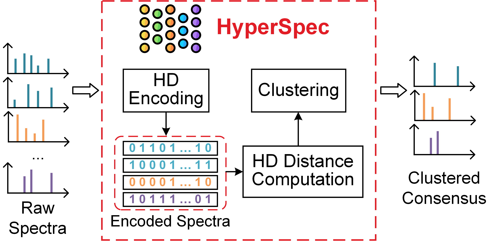

HyperSpec: Ultra-fast Mass Spectra Clustering in Hyperdimensional Space
=======================================================

    

_HyperSpec_ is a Python library that supports extremely fast spectra clustering. _HyperSpec_ adopts the brain-inspired hyperdimensional (HD) computing to project the spectra data into binary hyperdimensional space to obtain better clustering quality and faster clustering speed. _HyperSpec_ shortens the runtime on the draft human proteome dataset with 25 million spectra from a few hours to <15 minutes. The software is available as open-source under the BSD license.

System Requirements
------------------------------------------------------

_HyperSpec_ requires `Python 3.8+` with `CUDA` environment. A GPU should be installed properly. _HyperSpec_ has been tested on two types of NVIDIA GPUs on a Linux platform, including GTX 1080Ti and GTX 3090. 

- Clustering for PXD000561 dataset requires GTX 3090 with larger memory
- Clustering for other dataset with smaller scale requires GTX 1080Ti

Other NVIDIA GPUs should support but need further test. We recommend using high-performance SSD as the storage device for the best performance.

Installation
------------------------------------------------------

Install via Docker
*********************

We recommend installing _HyperSpec_ via docker using the following command:

    docker build --no-cache -f ./docker/Dockerfile -t hyper_spec .
    docker run --gpus all -v /ms-dataset/:/dataset/ -it hyper_spec /bin/bash

Install from Source
*********************

    git https://github.com/wh-xu/Hyper-Spec.git
    sh install.sh

Usage and Example
------------------------------------------------------

    usage: python src/main.py [-h] [--cpu_core_preprocess CPU_CORE_PREPROCESS] [--cpu_core_cluster CPU_CORE_CLUSTER]
                [--batch_size BATCH_SIZE] [--use_gpu_cluster] [--min_peaks MIN_PEAKS]
                [--mz_interval MZ_INTERVAL] [--min_mz_range MIN_MZ_RANGE] [--min_mz MIN_MZ] [--max_mz MAX_MZ] 
                [--remove_precursor_tol REMOVE_PRECURSOR_TOL] [--min_intensity MIN_INTENSITY]
                [--max_peaks_used MAX_PEAKS_USED] [--scaling {off,root,log,rank}] [--hd_dim HD_DIM] [--hd_Q HD_Q] [--hd_id_flip_factor HD_ID_FLIP_FACTOR]
                [--cluster_charges [CLUSTER_CHARGES ...]] 
                [--precursor_tol PRECURSOR_TOL PRECURSOR_TOL] [--rt_tol RT_TOL] [--fragment_tol FRAGMENT_TOL] [--eps EPS]
                [--cluster_alg {dbscan,hc_single,hc_complete,hc_average}]
                [--refine REFINE]
                [--checkpoint CHECKPOINT] [--representative_mgf]
                input_filepath output_filename

    Positional arguments:
    input_filepath          The path containing the `MGF` files for raw spectra data
    output_filename         Output CSV file that stores the clustering results.

    Optional arguments:
    -h, --help                  Show the help messages
    --cpu_core_preprocess       The number of CPU cores used for preprocessing. (default: 6)
    --cpu_core_cluster          The number of CPU cores used for clustering. 
                                Only enable when `use_gpu_cluster` is True. (default: 6)
    --batch_size                The batch size for HD encoding on GPU. (default: 5000)
    --use_gpu_cluster           Flag that determines whether to use DBSCAN 
                                on GPU. (default: True)
    --hd_dim                    The HD dimension. (default: 2048)
    --hd_Q                      The HD quantization level. (default: 16)
    --cluster_charges           The charges to be clustered. (default: 2 3)
    --cluster_alg               Select DBSCAN or hierarchical clustering algorithm (including dbscan, hc_single, hc_complete, and hc_average) for spectra (default: hc_complete) 
    --eps                       The threshold value `eps` for DBSCAN clustering. 
                                (default: 0.4)
    --refine                    Flag to determine whether refine the clustering results.
                                (default: True)
    --representative_mgf        Flag to determine whether exporting the clustering representatives.
                                (default: False)
    --checkpoint                The checkpoint filename to save the encoded HVs of spectra (default: None)

_HyperSpec_ supports running using the command line and takes `MGF` peak files as input and exports the clustering result as a CSV file with each MS/MS spectrum and its cluster label on a single line. Here we provide two examples of running _HyperSpec_:

### Example 1

    python src/main.py ~/dataset/ ./output.csv  --cpu_core_preprocess=4 --cluster_alg dbscan --use_gpu_cluster --cluster_charges 2 3 --eps=0.2 --refine

This will cluster all MS/MS spectra in folder `~/dataset/` on `GPU` and generate the `output.csv` file. The number of CPU cores for preprocessing is `4`. Only `Charge 2` and `Charge 3` are clustered in this configuration. The DBSCAN clustering threshold is `eps=0.2` and post-clustering refinement is `enable`.

### Example 2

    python src/main.py ~/dataset/ ./output.csv  --cpu_core_preprocess=4 --cluster_alg hc_complete --cluster_charges 2 3 --eps=0.25 --refine

This will cluster all MS/MS spectra in folder `~/dataset/` using `hierarchical clustering with complete linkage` on `CPU` and generate the `output.csv` file. The number of CPU cores for preprocessing is `4`. Only `Charge 2` and `Charge 3` are clustered in this configuration. The hierarchical clustering threshold is `eps=0.25` and post-clustering refinement is `enable`.

Exported results format
------------------------------------------------------
The exported meta data for clustering results are compressed and stored in `parquet` file, which records `bucket`, `precursor_charge`, `precursor_mz`, `identifier`, `scan`, `retention_time`, `cluster`, and `is_representative` information. The format is given as:

|bucket|precursor_charge|precursor_mz|identifier|scan                              |retention_time|cluster   |is_representative|
|------|----------------|------------|----------|----------------------------------|--------------|----------|-----------------|
|598   |2               |300.148804  |Adult_Gallbladder_bRP_Elite_53_f07|338                               |165.133194    |664       |True             |
|5384  |3               |1796.564697 |Fetal_Ovary_bRP_Velos_41_f18|4875                              |2896.885986   |4455302   |False            |

How HyperSpec Works
------------------------------------------------------

    

1. _HyperSpec_ first encodes the processed spectra into binary hypervector (HV) with ultra-high dimension (>1000) based on level-id encoding method. The encoding module is implemented and optimized for GPU for shorter runtime.
2. The entire dataset is divided into small buckets and the pairwise Hamming distance matrix for each bucket is computed. _HyperSpec_ implements very efficient Hamming distance computation kernels on GPU.
3. _HyperSpec_ finally clusters each spectra bucket using DBSCAN algorithm. Thanks HD computing's lightweight computation and powerful data presentation capability, _HyperSpec_ achieves significant speedup over other spectra clustering tools. Most of spectra datasets can be clustered within a few minutes.

Publication
------------------------------------------------------
1. Xu, Weihong, Jaeyoung Kang, Wout Bittremieux, Niema Moshiri, and Tajana Rosing. "HyperSpec: Ultrafast Mass Spectra Clustering in Hyperdimensional Space." [Journal of Proteome Research (2023)](https://pubs.acs.org/doi/full/10.1021/acs.jproteome.2c00612).
2. Sumukh Pinge, Weihong Xu, Jaeyoung Kang, Tianqi Zhang, Niema Moshiri, Wout Bittremieux, and Tajana Rosing. "SpecHD: Hyperdimensional Computing Framework for FPGA-Based Mass Spectrometry Clustering." [Design, Automation & Test in Europe Conference & Exhibition (DATE) 2024](https://ieeexplore.ieee.org/abstract/document/10546776).

Contact
------------------------------------------------------

For more information, post an issue or send an email to <wexu@ucsd.edu>.
